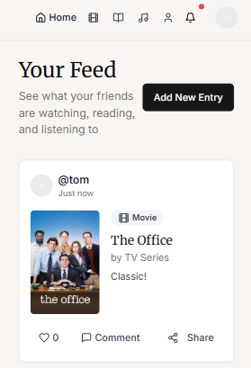
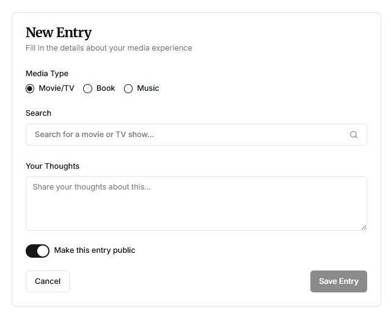
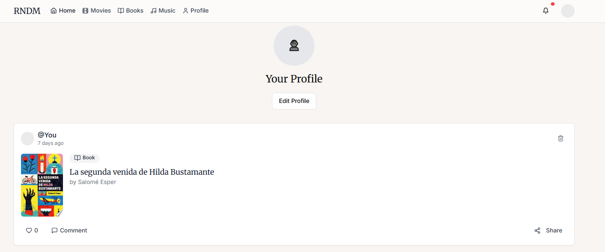
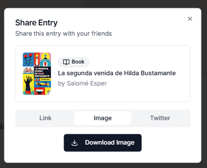

# RNDM

RNDM is a web app for tracking watched series and movies, read books, and listened to music.  
It can be used as a **private log** or as a **public social feed**, where users can share and discover cultural content through recommendations.

---

### 🛠 Tech Stack

- **Next.js**
- **Tailwind CSS**
- **Shadcn/ui**
- **Supabase**
- **V0** (AI UI generation)
- **Cursor** (AI coding assistant)

---

### 📸 Screenshots

| Home Feed | Add New Entry |
|-----------|----------------|
|  |  |

| Profile View | Share |
|--------------|-------|
|  |  |
